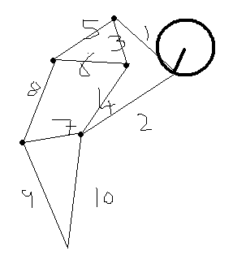
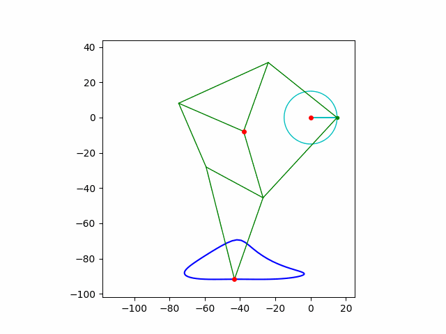

# Jansen's linkage

Python animation of the [Jansen's linkage](https://en.wikipedia.org/wiki/Jansen%27s_linkage).
This is the mechanism used in [strandbeest](https://www.strandbeest.com)'s leg movement.

> Veritasium [video link](https://youtu.be/IFaAjR_RRJs?si=XJjuEAf3pVuJDJcR)

## Leg links

I am using my own numbering system to describe the links.

## Generated animation with the holy numbers

> Find the holy numbers [here](https://www.strandbeest.com/explains)

